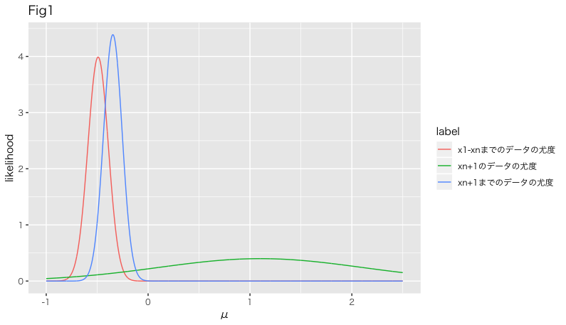

# 01_簡単な例でみるカルマンフィルタの考え方

次のような測定でカルマンフィルタについて考える；  

- 真の値$\mu$の時間的に変化しない物理量を測定する
- 測定値は誤差を含んでいて、その誤差は${\mathcal N}(0, \sigma^2)$の確率分布に従うものとする
- 測定は複数回行うものとする

このケースのカルマンフィルタとは、式番号(4)のことを指し、左辺第二項の係数をカルマンゲインと呼ぶ。(参考文献：[線形カルマンフィルタの基礎3.3 逐次処理]  )

[線形カルマンフィルタの基礎3.3 逐次処理]:https://www.jstage.jst.go.jp/article/sicejl/56/9/56_632/_pdf

---

上の前提で、$i$回目の測定値は以下のように表される;
$$
\begin{eqnarray}
X_i =\mu + V_i,  \hspace{2em}   V_i~\sim {\mathcal N}(0, \sigma^2)  \tag{1}
\end{eqnarray}
$$
いま測定が$n$回行われており、測定値$x_1, x_2,\cdots, x_n$がわかっているとする。 $\mu$の推定値$\hat{\mu}_n$として、標本平均を使う。つまり
$$
\begin{eqnarray}
\hat{\mu}_n := \frac{1}{n}\sum_{i=1}^nx_i  \tag{2}
\end{eqnarray}
$$
この後、$n+1$回目の測定値$x_{n+1}$が得られたとする。$x_{n+1}$を取り込んだ推定値$\hat{\mu}_{n+1}$は
$$
\begin{eqnarray}
\hat{\mu}_{n+1} &:=& \frac{1}{n+1}\sum_{i=1}^{n+1}x_i\\
                 &=&\frac{n}{n+1}\hat{\mu}_n+\frac{1}{n+1}x_{n+1}  \tag{3}
\end{eqnarray}
$$
となり、更に式変形をすると
$$
\begin{eqnarray}
\hat{\mu}_{n+1} = \hat{\mu}_n+\frac{1}{n+1}(x_{n+1}-\hat{\mu}_n) \tag{4}
\end{eqnarray}
$$
となる。(4)の左辺第二項の係数$\frac{1}{n+1}$をカルマンゲインという。この式の解釈として"$n$回目目までの推定値$\hat{\mu}_n$に対して、新たに得たデータ$\hat{\mu}_n$を使い推定値を変更した（精度向上を期待して）"と見ることができる

以上の推定値更新の手続きであるカルマンフィルタを、最尤法の観点で改めて考える。

$\hat{\mu}_{n}$との尤度関数について、$\hat{\mu}_{n}$は${\mathcal N}(\mu, \frac{\sigma^2}{n})$に従う確率変数の実現値と考えて良いので、
$$
\begin{eqnarray}
l_{\hat{\mu}_n} = \frac{1}{\sqrt{ 2\pi \sigma^2/n}}e^{\frac{(\hat{\mu}_n-\mu )^2}{2\sigma^2/n}} \tag{5}
\end{eqnarray}
$$
一方、$x_{n+1}$の尤度関数は、
$$
\begin{eqnarray}
l_{x_{n+1}} = \frac{1}{\sqrt{ 2\pi \sigma^2}}e^{\frac{(x_{n+1}-\mu )^2}{2\sigma^2}} \tag{6}
\end{eqnarray}
$$
この２つの尤度関数をplotしたのが下図になる。

真の値$\mu=0$、測定値の分散$\sigma^2=0$、$n=10$として描いた  
赤のラインがデータが$n$個時点での尤度関数である。緑のラインが$n+1$回目の測定で得られた結果単独での尤度関数である。それぞれのピークでの$\mu$の値が点推定になる。になる。この２つの結果を踏まえて、新たに推定し直すことを考える。

$\hat{\mu}_{n},x_{n+1}$は独立であることから、同時分布はそれぞれの分布の積となる。したがって、尤度関数も積となり、結局、
$$
\begin{eqnarray}
l_{\hat{\mu}_{n+1}}=l_{\hat{\mu}_n}l_{x_{n+1}} \propto e^{ \frac{\left(\frac{1}{n+1}(n \hat{\mu}_n+x_{n+1})-\mu \right)^2}{2\sigma^2/(n+1)}}
\tag{7}
\end{eqnarray}
$$
が$x_1, x_2,\cdots, x_{n+1}$のデータを得たときの尤度関数となる。この尤度を最大化させるの$\mu$を$\hat{\mu}_{n+1}$とすれば、（当然）カルマンフィルタの式(3), (4)を得る。Fig1における青のラインは$l_{\hat{\mu}_{n+1}}$を$\mu$の積分に関して規格化したものである。
(7)はベイズの定理に対応しており、$l_{\hat{\mu}_{n}}$を事前分布、$l_{\hat{\mu}_{n+1}}$の規格化したものを事後分布に対応している。

今後ローカルレベルモデルにカルマンフィルタを適応することを考える。今回の例とローカルレベルモデルの利用例の一番の違いは、真の値$\mu$が時変することにある。この違いはあれど、今回考えたカルマンフィルタの考え方は基本的に同じになる；

- 前提
    - 真の値を推定できる推定値が独立に逐次的に得られる
- カルマンフィルタ考え方
    - 得られた最新のデータを使って尤度（事後確率）を最大化する推定値を考える
        - 最新のデータを得る前の推定値を事前推定値と呼ぶ

