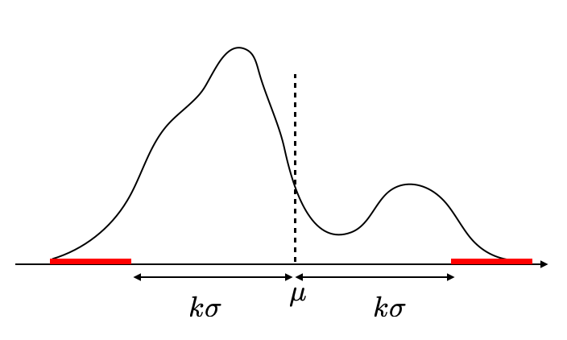

# チェビシェフの不等式
- 平均と分散が定義できる任意の確率変数で成り立つ恐ろしい不等号
- しかし不等号がガバガバなので実務では直接利用することはない
- 大数の法則の導出に利用する
- 証明は"統計学入門（東京大学出版会）"から
---
- **チェビシェフの不等式**
任意の確率変数$X$は次の不等式に従う
    $$
    P(|X-\mu|\geq k \sigma)\leq\frac{1}{k^2}   \tag{1}
    $$
ただし、$\mu=E(X)$、$\sigma^2=V(X)$で$k$は任意の実数
---
**証明**
$I=\{x:|x-\mu|\geq k\sigma\}$とおく。（図の赤の部分の区間）

$$\begin{align}
\sigma^2 &=\int_{-\infty}^{\infty}(x-\mu)^2f(x) dx\\
&\geq \int_{I}(x-\mu)^2f(x) dx\\
&\geq \int_{I}(k\sigma)^2f(x) dx\\
&=    (k\sigma)^2\int_{I}f(x) dx\\
&=    (k\sigma)^2P(|X-\mu|\geq k \sigma)
\end{align}$$
これより
$$
P(|X-\mu|\geq k \sigma)\leq\frac{1}{k^2}   
$$